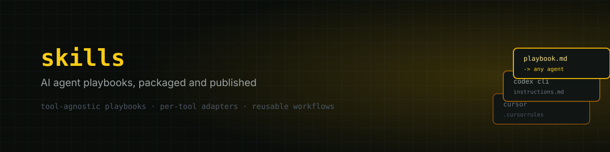

<p align="center">
  
</p>

<p align="center">
  <a href="https://github.com/abe-source/skills/blob/main/LICENSE"></a>
  
</p>

Claude Code [skills](https://docs.claude.com/en/docs/claude-code/skills) I've built and use day to day — packaged up and published here as they're generalized enough to be useful to anyone, not just tied to my own setup.

## What's a skill

A skill is a folder with a `SKILL.md` file: a description (so Claude knows when to use it) plus instructions for how to carry out a specific task. Drop a skill's folder into `~/.claude/skills/` and Claude Code picks it up automatically — invoke it directly with `/<skill-name>`, or let Claude reach for it on its own when the description matches what you're doing.

## Skills

_Nothing published yet — check back soon._

## Installation

Once a skill is published here:

```bash
git clone https://github.com/abe-source/skills.git
cp -r skills/<skill-name> ~/.claude/skills/
```

## License

MIT
